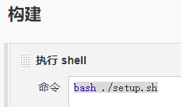

### 部署方案

#### 方案一
~~~
基于 node 镜像构建打包，然后 将构建后的代码拷贝到 nginx 镜像，启动 nginx 。
   
    i. 问题：

      1) 构建环境需要一致，容易出现网络问题拉取不到相关依赖代码。
      2) 环境设置可能会与本地环境不一致，照成打包后的代码出现偏差。
      3) 构建时间较长，每次都是重新拉取相关依赖。
      4) 比如 element-ui 的构建，基础Node镜像，需要自己解决一大堆环境问题。 
      
    ii. 优点：

      1) 多人开发可以保证生成的代码为最新。
      2) 适用于项目相关依赖不多的情况

~~~
----

####  方案二
~~~
本地环境构建，将构建后的代码提交到GitLeb上， 直接使用  nginx  镜像 启动 nginx
      i. 优点：

        1) 研发与测试、正式环境代码相同，不会出现偏差。
        2) 镜像生成时间短。

      ii. 缺点：
        1) 需要人工来保证最新代码
~~~
### 具体实施

##### 方案一
~~~
    a. 根路径新增 Dockerfile 文件
    
      FROM node:12-alpine3.10  as build-stage
      WORKDIR /app
      COPY package*.json ./
      RUN npm config set registry http://mvn.zjs.com.cn/nexus/content/groups/npm-all/
      RUN npm install
      # 拷贝 当前目录下所有文件到 容器 /app目录下
      COPY . .
      # 运行的构建命令
      RUN npm run build
      # production stage
      FROM nginx:latest as production-stage
      # 设置时区为上海
      RUN cp /usr/share/zoneinfo/Asia/Shanghai /etc/localtime
      # 文件路径 设置正确地址    /app 为根路径
      COPY --from=build-stage /app/dist /usr/share/nginx/html
      EXPOSE 80
      CMD ["nginx", "-g", "daemon off;"]
      
    b. 根路径新增 setup.sh 文件
      
      # 构建新的镜像   注意 . 不能少！
      sudo  docker build -t 系统名称:版本号 .;
      # 登录 私有镜像仓库
      sudo  docker login  -u 用户名 -p 密码 hbt.zjs.com.cn;
      # 推送本地镜像到镜像厂库 
      sudo  docker push 系统名称:版本号;
~~~
    
##### 方案二
~~~
    a. 根路径新增 Dockerfile 文件

      i. 内容：
      
            # 基础镜像
            FROM nginx:latest
            # 设置时区为上海
            RUN cp /usr/share/zoneinfo/Asia/Shanghai /etc/localtime 
            # 描述
            MAINTAINER atliwen
            # 打包文采后的路径  
            COPY dist  /usr/share/nginx/html/  
          
    b. 根路径新增 setup.sh 文件

      i. 内容：
      
          # 镜像名称 完整地址 
          registry="hbt.zjs.com.cn/atliwen/elemenet"
          # 版本号 于Git 版本应该相同
          version="0.0.01"
          # 构建新的镜像 注意 . 不能少。
          docker build -t $registry:$version .;
          # 登录 私有镜像仓库
          #sudo docker login -u 用户名 -p 密码 hbt.zjs.com.cn;
          docker login --username=用户名 -p 密码  hbt.zjs.com.cn
          # 推送本地镜像到镜像厂库
          # sudo docker push 系统名称:版本号;
          docker push $registry:$version
~~~
---

### 自动构建：
 
~~~

  与正常项目构建相同，注意执行的 shell 命令
  
  
  
  请联系测试部门进行配置 jenkins 。
  
  理论上 setup.sh 可以在 jenkins 配置好 ，不需要手写。
~~~

###  注意事项：
  
  * 当方案一构建报错的时候。主要是问题是镜像环境问题，可以自己维护一个依赖环境较全的基础镜像。
  
  * 当方案一构建困难的时候，请使用方案二。并保证本地环境构建时候代码为最新。
  
  
### K8S 容器启动：

  * 请查询相关 wiki 文章，如需账户等，请联系 运维部。
